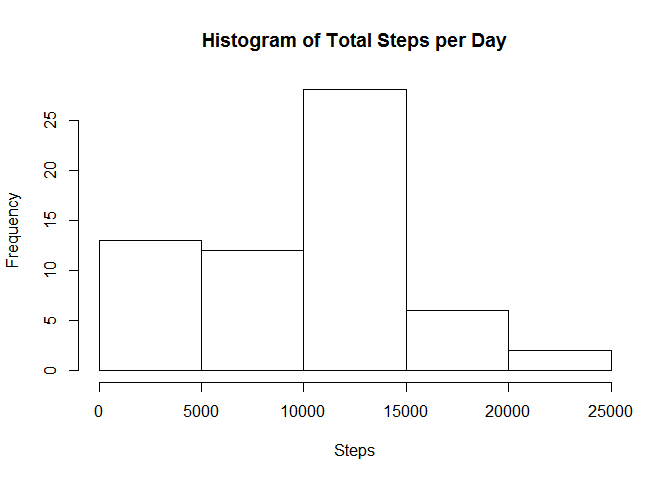
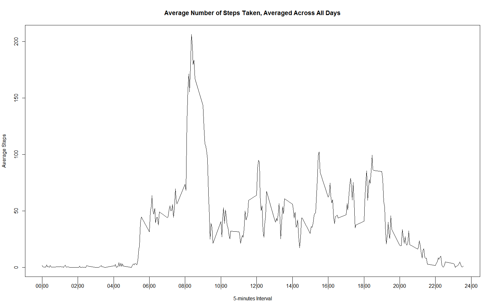
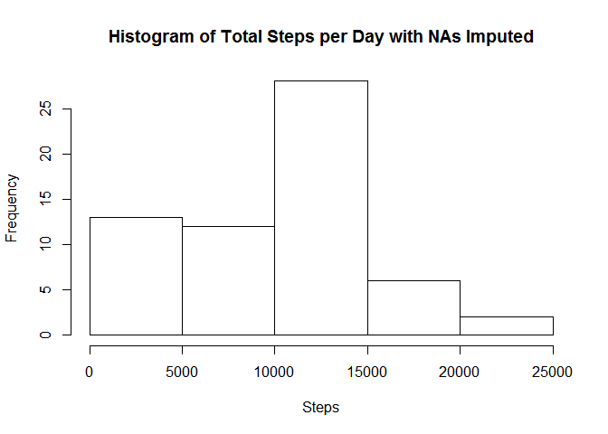
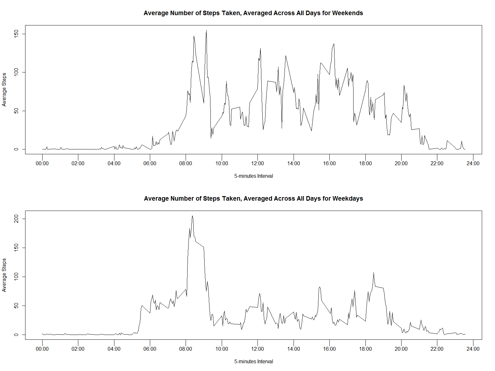

## Loading and preprocessing the data
1. Load the data.table package to read and process the data.


```r
library(data.table)
```

2. Read the activity data using fread (fread has the ability to run shell
commands such as unzip).


```r
activities <- fread("unzip -p activity.zip")
```

3. convert interval and date variables to the correct data type and format.


```r
activities[
    ,
    interval := formatC(interval, width = 4, format = "d", flag = "0")
    ]
activities[
    ,
    interval := as.POSIXct(paste(date,interval),format = "%Y-%m-%d%H%M")
    ]
activities[, date := as.Date(date)]
```

The variables included in this dataset are:

* **steps**: Number of steps taking in a 5-minute interval (missingvalues are
coded as `NA`).

* **date**: The date on which the measurement was taken in YYYY-MM-DD format.

* **interval**: Identifier for the 5-minute interval in which measurement was
taken (modified to data-time POSIXct format).


```r
summary(activities)
```

```
##      steps           date               interval                  
##  Min.   :  0    Min.   :2012-10-01   Min.   :2012-10-01 00:00:00  
##  1st Qu.:  0    1st Qu.:2012-10-16   1st Qu.:2012-10-16 05:58:45  
##  Median :  0    Median :2012-10-31   Median :2012-10-31 11:57:30  
##  Mean   : 37    Mean   :2012-10-31   Mean   :2012-10-31 12:23:58  
##  3rd Qu.: 12    3rd Qu.:2012-11-15   3rd Qu.:2012-11-15 17:56:15  
##  Max.   :806    Max.   :2012-11-30   Max.   :2012-11-30 23:55:00  
##  NA's   :2304
```

## What is mean total number of steps taken per day?
1. Group data by month-day and summarize total steps and plot the results as a histogram.


```r
stepsByDay <- activities[
    ,
    sum(steps, na.rm = TRUE),
    by=format(activities$date, format = "%m-%d")
    ]
hist(
    stepsByDay$V1,
    main = "Histogram of Total Steps per Day",
    xlab = "Steps"
    )
```

<!-- -->

2. The mean of the total number of steps per day is: 
**9354.23**

3. The median of the total number of steps per day is: 
**10395**

## What is the average daily activity pattern?
1. Group the data by interval and calculate the average of the steps taken
across all days and present the result as a time series plot.


```r
stepsByInterval <- activities[
    ,
    mean(steps, na.rm = TRUE),
    by=format(interval, "%H%M")
    ]
v1 <- seq(0,2400,by=200)
v2 <- paste0(
    formatC(
        seq(0,24,by=2),
        width = 2,
        format = "d",
        flag = "0"
        ),
    ":",
    rep("00",times=12)
    )
plot(
    stepsByInterval,
    type = "l",
    main = "Average Number of Steps Taken, Averaged Across All Days",
    ylab = "Average Steps",
    xlab = "5-minutes Interval",
    xaxt = "n"
    )
axis(side = 1, at = v1, labels = v2, tck=-.05)
```

<!-- -->

2. The 5-minute interval #
**0835**
has on average:
**206.17** steps.

## Imputing missing values
1. The total number of rows with missing data (NAs) is:
**2304**
2. We'll use the median for each 5-minutes interval across all days to replace
the NA values


```r
activities[
    ,
    "steps" := lapply(
        "steps",
        function(x) {
            x <- get(x)
            x[is.na(x)] <- median(x, na.rm = TRUE)
            x
            }
        ),
    by = format(interval, "%H%M")]
```

3. The new dataset with the missing data filled in looks like this:


```r
summary(activities)
```

```
##      steps          date               interval                  
##  Min.   :  0   Min.   :2012-10-01   Min.   :2012-10-01 00:00:00  
##  1st Qu.:  0   1st Qu.:2012-10-16   1st Qu.:2012-10-16 05:58:45  
##  Median :  0   Median :2012-10-31   Median :2012-10-31 11:57:30  
##  Mean   : 33   Mean   :2012-10-31   Mean   :2012-10-31 12:23:58  
##  3rd Qu.:  8   3rd Qu.:2012-11-15   3rd Qu.:2012-11-15 17:56:15  
##  Max.   :806   Max.   :2012-11-30   Max.   :2012-11-30 23:55:00
```

4. Make a histogram of the total number of steps taken each day

```r
newStepsByDay <- activities[
    ,
    sum(steps, na.rm = TRUE),
    by=format(activities$date, format = "%m-%d")
    ]
hist(
    newStepsByDay$V1,
    main = "Histogram of Total Steps per Day with NAs Imputed",
    xlab = "Steps"
    )
```

<!-- -->

2. The new mean of the total number of steps per day with imputed missing data
is: 
**9503.87** compared to
**9354.23**
(the value without imputing the missing data)

3. The new median of the total number of steps per day with imputed missing data
is: 
**10395** compared to
**10395**
(the value without imputing the missing data)

The impact of having missing data imputed, in this case, is limited.  But still needs to be considered as the resulting average steps have changed.

## Are there differences in activity patterns between weekdays and weekends?
1. Create a new factor variable with two levels - "weekday" and "weekend"


```r
activities[
    weekdays(date) %in% c("Saturday", "Sunday"),
    day := "weekend"
    ]
activities[
    !(weekdays(date) %in% c("Saturday", "Sunday")),
    day := "weekday"
    ]
activities[,day := as.factor(day)]
summary(activities)
```

```
##      steps          date               interval                  
##  Min.   :  0   Min.   :2012-10-01   Min.   :2012-10-01 00:00:00  
##  1st Qu.:  0   1st Qu.:2012-10-16   1st Qu.:2012-10-16 05:58:45  
##  Median :  0   Median :2012-10-31   Median :2012-10-31 11:57:30  
##  Mean   : 33   Mean   :2012-10-31   Mean   :2012-10-31 12:23:58  
##  3rd Qu.:  8   3rd Qu.:2012-11-15   3rd Qu.:2012-11-15 17:56:15  
##  Max.   :806   Max.   :2012-11-30   Max.   :2012-11-30 23:55:00  
##       day       
##  weekday:12960  
##  weekend: 4608  
##                 
##                 
##                 
## 
```

2. Make a time-series plot of the 5-minute interval (x-axis) and the average number of steps taken, averaged across all weekday days or weekend days


```r
stepsByIntervalWeekend <- activities[
    day == "weekend"
    ][
        ,
        mean(steps, na.rm = TRUE),
        by=format(interval, "%H%M")
        ]
stepsByIntervalWeekday <- activities[
    day == "weekday"
    ][
        ,
        mean(steps, na.rm = TRUE),
        by=format(interval, "%H%M")
        ]
par(mfrow = c(2,1))
plot(
    stepsByIntervalWeekend,
    type = "l",
    main = "Average Number of Steps Taken, Averaged Across All Days for Weekends",
    ylab = "Average Steps",
    xlab = "5-minutes Interval",
    xaxt = "n"
    )
axis(side = 1, at = v1, labels = v2, tck=-.05)
plot(
    stepsByIntervalWeekday,
    type = "l",
    main = "Average Number of Steps Taken, Averaged Across All Days for Weekdays",
    ylab = "Average Steps",
    xlab = "5-minutes Interval",
    xaxt = "n"
    )
axis(side = 1, at = v1, labels = v2, tck=-.05)
```

<!-- -->
